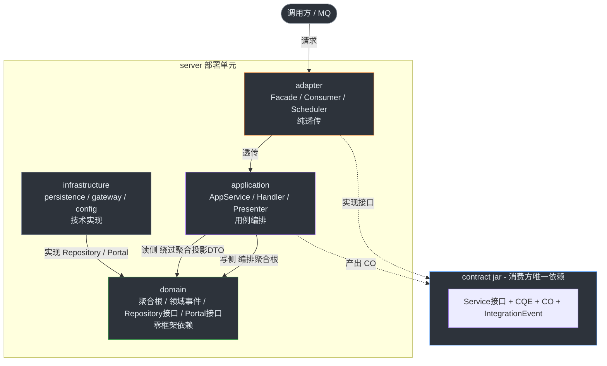

# ywf-ddd-java

基于 DDD 战术模式的 Java 微服务基础框架 + 示例应用。  
基本上纯AI生成，人类只提供审核下的代码品味意见。也是想测试AI辅助究竟能走到哪一步。  
~~你将会看到 Java后端开发 在AI时代的最后一丝余晖~~

## 项目背景

这是一个面向生产环境的微服务基础框架，目标是将 DDD 战术模式落地为可复用的公共模块 + 可参照的示例应用。

技术栈：Spring Boot 4 + Spring MVC（对外 REST）+ Boot 原生 gRPC（东西向）、Nacos 客户端（二期注册发现预留）、Seata 分布式事务、Higress 云原生网关，部署目标为阿里云。

> **当前状态**：探索性脚手架项目，外围环境暂未备齐，未经历真实生产考验。比较适合用作结构参考和学习，暂时不推荐直接用于生产环境。

## 开发环境

这基本上是一个 **AI Coding 含量99.999%** 的项目（纯天然AI，无人工添加，请提心吊胆食用）  
项目主要使用 **Qoder** 作为开发工具，选择 **Qwen3.7/Qwen3.8** 模型  
部分时间使用 **OpenCode** 作为开发工具，选择 **DeepSeek V4** 模型（仅作小范围修改）  
AI审核使用 **Qoder** 作为开发工具，选择 **Ultimate** 模型  
人工审核使用 **IntelliJ IDEA** 进行手动调整

## 快速开始

> 目前项目的测试代码全量 AI 生成，并未经过真实生产测试。真实的运行环境和示例场景仍在构建中。

```bash
# 克隆（含 submodule）
git clone --recurse-submodules git@github.com:yoursweakfoe/ywf-ddd-java.git

# 一键构建全项目（根聚合 pom 统一构建顺序）
mvn clean install
```

## 架构概览



## 仓库结构

```
ywf-ddd-java/
├── ywf-ddd-common/        # 公共基础框架（submodule → ywf-ddd-java-ywf-ddd-common）
├── sample-application/    # 示例业务服务（submodule → ywf-ddd-java-sample-application）
├── docs/                  # 项目级文档（架构理论 + 应用架构设计）
├── .agents/               # AI 辅助开发规范（dotagents 约定，工具中立）
└── AGENTS.md              # AI 代理入口文件（厂商中立标准）
```

> 两个子项目均为 git submodule：
> - `ywf-ddd-common/` → [ywf-ddd-java-ywf-ddd-common](https://github.com/yoursweakfoe/ywf-ddd-java-ywf-ddd-common)
> - `sample-application/` → [ywf-ddd-java-sample-application](https://github.com/yoursweakfoe/ywf-ddd-java-sample-application)
>
> 克隆本仓库时使用 `git clone --recurse-submodules` 以获取完整代码。
> 外部项目可将 `ywf-ddd-java-ywf-ddd-common` 以 submodule 引入，供 AI 直接阅读框架源码。

## AI 辅助开发

本项目采用 [dotagents](https://github.com/bgreenwell/dotagents) 约定，提供工具中立的 AI 辅助开发规范：

- **入口**：[`AGENTS.md`](AGENTS.md)（轻量路由器，厂商中立标准）
- **规则**（`.agents/rules/`）：分层架构、编码规范、禁止清单
- **技能**（`.agents/skills/`）：新建聚合、新增用例、新增事件、架构审查
- **术语**：[`docs/glossary.md`](docs/glossary.md)

任何 AI 编码工具（Cursor / Copilot / Claude Code / Qoder / Windsurf / Aider 等）均可接入。
详见 [`.agents/README.md`](.agents/README.md) 中的工具接入指南。

## 文档导航

**公共框架（ywf-ddd-common）：**

```
ywf-ddd-common/
├── README.md                    # 框架总览（模块结构、依赖拓扑、快速开始）
└── docs/
    ├── common-contract.md       # CQRS 契约标记接口
    ├── common-ddd.md            # DDD 战术框架（核心模块）
    ├── common-exception.md      # 统一异常体系
    ├── common-cloud.md          # 微服务治理
    ├── common-pg.md             # PostgreSQL 类型映射
    ├── common-security.md       # 身份上下文
    ├── common-observability.md  # 可观测性
    └── common-test.md           # 测试基础设施
```

**项目级（docs/）：**

```
docs/
├── references.md                        # 架构理论参考（采纳 / 未采纳及原因）
└── sample-application/
    ├── module-design/                   # 应用架构设计（分层职责、组件、规则）
    │   ├── contract.md
    │   ├── adapter.md
    │   ├── application.md
    │   ├── domain.md
    │   └── infrastructure.md
    ├── directory-structure/             # 目录结构参考（包结构速查）
    │   ├── overview.md
    │   ├── contract/contract.md
    │   └── server/{adapter,application,domain,infrastructure}.md
    └── cookbook/                        # 端到端代码实战（完整可编译示例）
        ├── write-path.md
        ├── read-path.md
        ├── cross-aggregate.md
        ├── event-flow.md
        ├── policy-pattern.md
        ├── gateway.md
        ├── new-aggregate.md
        ├── error-handling.md
        ├── batch-operations.md
        ├── scheduled-task.md
        ├── mq-consumer.md
        ├── distributed-transaction.md
        └── optimistic-lock-retry.md
```
