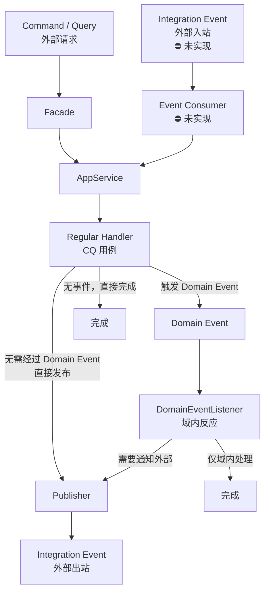

# 事件全链路

> 设计原理 → [module-design/domain.md](../module-design/domain.md)（事件边界章节）
> 事件事务语义详解 → `docs/common/common-ddd.md`（领域事件章节）

## 业务场景

本文以 **"订单取消 → 库存回补"** 为案例，完整展示领域事件的定义、注册、发布、监听和集成事件出站。

**为什么用事件而不是直接调用？**

| 如果直接调用 | 用领域事件 |
|---|---|
| `cancel()` 内硬编码 `replenishStock()` | `cancel()` 只注册事件，监听方自行决定做什么 |
| 新增副作用要改 `cancel()` | 新增 `@EventListener` 即可（OCP） |
| 回补失败导致取消回滚 | `@TransactionalEventListener(AFTER_COMMIT)` 断开事务 |

## 事件流全景

```
聚合根.cancel()
  → registerEvent(OrderCancelledEvent)         ① 暂存到聚合根内部 List

Repository.update(order)
  → updateDomain(order)                         ② 先落库（UPDATE）
  → publishAndClearEvents(order)                ③ 后发事件（先清后发）
    → InProcessDomainEventPublisher.publish(event)
      → applicationEventPublisher.publishEvent  ④ 交给 Spring

Spring 容器
  → OrderDomainEventListener.onOrderCancelled()  ⑤ 类型路由，触发监听
    → inventoryDomainService.replenishStock()   ⑥ 库存回补

（可选）Publisher
  → 翻译为 IntegrationEvent → 投递 MQ          ⑦ 跨服务通知
```

## 事件流图



## 实现状态

> 各环节在当前示例应用 / 框架中的落地情况；「未实现」的环节待 common-mq 模块建设后按本文模板补全。

| 环节 | 状态 | 落地位置 |
|------|------|---------|
| 领域事件定义 + 聚合根注册 | ✅ 已实现 | `domain/{agg}/model/event/` + `registerEvent()` |
| 仓储持久化后发布（先清后发） | ✅ 已实现 | `MybatisPersistence` → `DomainEventFlusher` → `InProcessDomainEventPublisher` |
| 域内反应（DomainEventListener） | ✅ 已实现 | `application/{agg}/event/listener/` |
| 集成事件契约 | ✅ 已实现 | `contract/{agg}/dto/event/integration/` |
| Publisher 出站 | ⚠️ 日志占位 | `application/{agg}/event/publisher/`，待 common-mq 接入 RocketMQTemplate |
| Consumer 入站 | ⛔ 未实现 | `adapter/consumer/`，设计见 [mq-consumer.md](mq-consumer.md) |

## 1. Domain — 定义 + 注册事件

```java
// domain/order/model/event/OrderCancelledEvent.java
public class OrderCancelledEvent extends DomainEvent {

    private final UUID orderId;
    private final String reason;

    public OrderCancelledEvent(UUID orderId, String reason) {
        super();  // 自动生成 eventId + occurredOn
        this.orderId = orderId;
        this.reason = reason;
    }

    public UUID getOrderId() { return orderId; }
    public String getReason() { return reason; }
}

// domain/order/model/Order.java（节选）
public void cancel(String reason) {
    requireStatus("order:err.status.cancellable", OrderStatus.PENDING, OrderStatus.PAID);
    this.status = OrderStatus.CANCELLED;
    this.cancelReason = reason;
    registerEvent(new OrderCancelledEvent(id, reason));  // 暂存，持久化后发布
}
```

## 2. Infrastructure — 仓储触发发布

```java
// MybatisPersistence 内部逻辑（common-ddd 框架代码）
public void updateDomain(Domain domain) {
    validateIfAggregate(domain);                // ① 不变量校验
    PO po = getConverter().toPO(domain);
    boolean success = updateById(po);           // ② UPDATE（乐观锁）
    if (!success) throw new IllegalStateException("...");
    publishAndClearEvents(domain);              // ③ 先清后发
}
```

关键契约：**先落库，后发事件**；**先清后发**（监听器异常不重复发布）。

## 3. Application — DomainEventListener 监听

```java
@Component
public class OrderDomainEventListener {

    private final OrderRepository orderRepository;
    private final InventoryDomainService inventoryDomainService;

    // 构造器注入（省略）

    /**
     * 订单取消 → 库存回补（补偿型副作用）。
     * AFTER_COMMIT + REQUIRES_NEW：主事务提交后执行，回补失败不阻断取消。
     */
    @TransactionalEventListener(phase = TransactionPhase.AFTER_COMMIT)
    @Transactional(propagation = Propagation.REQUIRES_NEW, rollbackFor = Exception.class)
    public void onOrderCancelled(OrderCancelledEvent event) {
        try {
            Order order = orderRepository.findById(event.getOrderId())
                    .orElseThrow(() -> new BusinessException("order:err.notFound"));
            inventoryDomainService.replenishStock(order.getItems());
        } catch (Exception e) {
            log.error("Stock replenish failed: orderId={}", event.getOrderId(), e);
        }
    }

    /** 简单日志监听（事务内同步） */
    @EventListener
    public void onOrderPlaced(OrderPlacedEvent event) {
        log.info("Order placed: orderId={}", event.getOrderId());
    }
}
```

监听器选型：`@EventListener` = 强一致（事务内）；`@TransactionalEventListener(AFTER_COMMIT)` = 补偿/通知（事务后）。详见 `common-ddd.md` 事件事务语义节。

## 4. Contract + Publisher — 集成事件出站

```java
// contract/order/dto/event/integration/OrderPlacedIntegrationEvent.java
@Data @NoArgsConstructor @AllArgsConstructor
public class OrderPlacedIntegrationEvent implements IntegrationEvent, Serializable {
    @Serial private static final long serialVersionUID = 1L;
    private String orderId;
    private String customerId;
}

// application/order/event/publisher/OrderEventPublisher.java
@Component
public class OrderEventPublisher {
    // 当前为日志占位，待 common-mq 模块建设后接入 RocketMQTemplate
    public void publishOrderPlaced(OrderPlacedEvent domainEvent) {
        OrderPlacedIntegrationEvent ie = new OrderPlacedIntegrationEvent(
                domainEvent.getOrderId().toString(), domainEvent.getCustomerId());
        log.info("Publishing integration event: {}", ie);
    }
}
```

## DomainEvent vs IntegrationEvent

| 维度 | DomainEvent | IntegrationEvent |
|------|-------------|------------------|
| 位置 | `domain/{agg}/model/event/` | `contract/{agg}/dto/event/integration/` |
| 基类 | `extends DomainEvent`（common-ddd） | `implements IntegrationEvent`（common-contract） |
| 受众 | 服务内部（@EventListener） | 外部服务（MQ 订阅） |
| 内容 | 丰富（领域细节） | 精简（仅外部需要的字段） |
| 可变性 | 不可变（final 字段） | 可变（需序列化框架反序列化） |
| 发布机制 | Spring Event（进程内） | MQ / RPC（跨服务） |

## 完整文件清单

| 层 | 文件 | 职责 |
|----|------|------|
| domain | `model/event/OrderCancelledEvent.java` | 领域事件定义 |
| domain | `model/Order.java` | registerEvent() 注册 |
| infrastructure | `repository/OrderRepositoryImpl.java` | 持久化后触发发布 |
| application | `event/listener/OrderDomainEventListener.java` | @EventListener 监听（域内反应） |
| application | `event/publisher/OrderEventPublisher.java` | 集成事件出站（占位） |
| contract | `dto/event/integration/OrderPlacedIntegrationEvent.java` | 跨服务契约 |
| adapter | `consumer/` ⛔ | 入站 Consumer（未实现，待 common-mq，见 [mq-consumer.md](mq-consumer.md)） |
