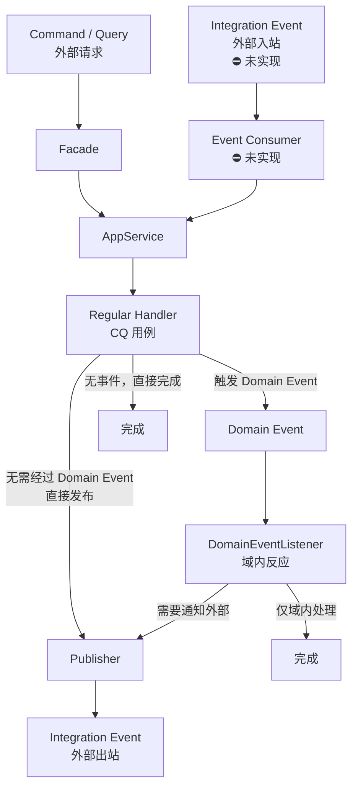

# 事件全链路

> 设计原理 → [module-design/domain.md](../module-design/domain.md)（事件边界章节）
> 事件事务语义详解 → `docs/common/common-ddd.md`（领域事件章节）

## 业务场景

本文以 **"订单取消 → 库存回补"** 为案例，完整展示领域事件的定义、注册、发布、监听和集成事件出站。

**为什么用事件而不是直接调用？**

| 如果直接调用 | 用领域事件 |
|---|---|
| `cancel()` 内硬编码 `replenishStock()` | `cancel()` 只注册事件，监听方自行决定做什么 |
| 新增副作用要改 `cancel()` | 新增 `@EventListener` 即可（OCP） |
| 回补失败导致取消回滚 | 框架经 Outbox 在提交后投递，监听器与主事务断开 |

## 事件流全景

```
聚合根.cancel()
  → registerEvent(OrderCancelledEvent)         ① 暂存到聚合根内部 List

Repository.update(order)
  → updateDomain(order)                         ② 先落库（UPDATE）
  → DomainEventFlusher 先清后发                 ③ 快照事件、清空暂存

  ┌ 业务提供了 OutboxStore Bean（可靠路径）────────────────────────┐
  │ → OutboxStore.appendAll  ④ 事件入箱（与业务同事务——可靠性锚点） │
  │   ★ 框架领地到此为止（契约 + 编解码工具）                        │
  │ 业务事务提交后 → 业务排空器：认领 → 重建身份 → 发布（业务领地）    │
  └────────────────────────────────────────────────────────────┘
  ┌ 未提供 OutboxStore（本样例 = 直发降级路径）────────────────────┐
  │ → afterCommit 回调 ④' 经 InProcessDomainEventPublisher 发布     │
  └────────────────────────────────────────────────────────────┘

  → InProcessDomainEventPublisher.publish        ⑤ 交给 Spring

Spring 容器（无活动事务的提交后上下文）
  → OrderDomainEventListener.onOrderCancelled()  ⑥ 类型路由，触发监听
    → inventoryDomainService.replenishStock()   ⑦ 库存回补（自带 REQUIRES_NEW 事务）

（可选）Publisher
  → 翻译为 IntegrationEvent → 投递 MQ          ⑧ 跨服务通知
```

> 可靠性语义（audit F-04 收口，领地收缩后定稿，详见 `docs/common/common-ddd.md` Outbox 节）：
> 框架只给 **Outbox 捕获契约**（`OutboxStore` SPI）+ 编解码工具（`DomainEventCodec`），
> **不提供缺省实现**——实现、排空 / 重试 / 死信全部归业务，或直接交给生态方案（事务消息 / CDC /
> Modulith EPR）。本样例未提供 `OutboxStore`，走直发降级路径（提交后进程内派发，
> at-most-once）；两条路径监听器都在提交后执行。

## 事件流图



## 实现状态

> 各环节在当前示例应用 / 框架中的落地情况；「未实现」的环节待 common-mq 模块建设后按本文模板补全。

| 环节 | 状态 | 落地位置 |
|------|------|---------|
| 领域事件定义 + 聚合根注册 | ✅ 已实现 | `domain/{agg}/event/domain/` + `registerEvent()` |
| 仓储持久化后冲刷（先清后发） | ✅ 已实现 | `MybatisPlusPersistence` → `DomainEventFlusher` |
| Outbox 捕获契约（框架领地） | ✅ 已提供 | 框架 `OutboxStore` SPI + `DomainEventCodec`（`OutboxAutoConfiguration` 装配 codec）；**无缺省实现**，参考表结构 `sql/ddd_outbox.example.sql` |
| Outbox 捕获实现 + 排空投递（业务领地） | ⛔ 未实现 | 本样例未提供 `OutboxStore`（走直发降级路径）；待真实业务落地，或直接选用生态方案 |
| 域内反应（DomainEventListener） | ✅ 已实现 | `application/{agg}/event/listener/` |
| 集成事件契约 | ✅ 已实现 | `contract/{agg}/dto/event/integration/` |
| Publisher 出站 | ⚠️ 日志占位 | `application/{agg}/event/publisher/`，待 common-mq 接入 RocketMQTemplate |
| Consumer 入站 | ⛔ 未实现 | `adapter/event/consumer/`，设计见 [mq-consumer.md](mq-consumer.md) |

## 1. Domain — 定义 + 注册事件

```java
// domain/order/event/domain/OrderCancelledEvent.java
public class OrderCancelledEvent extends DomainEvent {

    private final UUID orderId;
    private final String reason;

    public OrderCancelledEvent(UUID orderId, String reason) {
        super();  // 自动生成 eventId + occurredOn
        this.orderId = orderId;
        this.reason = reason;
    }

    public UUID getOrderId() { return orderId; }
    public String getReason() { return reason; }
}

// domain/order/model/Order.java（节选）
public void cancel(String reason) {
    requireStatus("order:err.status.cancellable", OrderStatus.PENDING, OrderStatus.PAID);
    this.status = OrderStatus.CANCELLED;
    this.cancelReason = reason;
    registerEvent(new OrderCancelledEvent(id, reason));  // 暂存，持久化后发布
}
```

## 2. Infrastructure — 仓储触发冲刷 + Outbox 入箱

```java
// MybatisPlusPersistence 内部逻辑（common-ddd 框架代码）
public void updateDomain(Domain domain) {
    validateIfAggregate(domain);                // ① 不变量校验
    PO po = getConverter().toPO(domain);
    int rows = baseMapper.updateById(po);       // ② UPDATE（乐观锁）
    if (rows == 0) throw ...;
    eventFlusher.publishAndClear(domain);       // ③ 先清后发 → Outbox 入箱（同事务）
}
```

关键契约：**先落库，后冲刷**；**先清后发**（监听器异常不重复发布）；**入箱与业务写入同事务**
（提交后崩溃不丢事件，业务回滚事件随行回滚）。

## 3. Application — DomainEventListener 监听

```java
@Component
public class OrderDomainEventListener {

    private final OrderRepository orderRepository;
    private final InventoryDomainService inventoryDomainService;

    // 构造器注入（省略）

    /**
     * 订单取消 → 库存回补（补偿型副作用）。
     * 投递已在取消事务提交后发生（直发路径 = afterCommit 派发；
     * 业务接 Outbox 后 = 排空器投递）：普通 @EventListener 即可，
     * 不要用 @TransactionalEventListener(AFTER_COMMIT)（无事务可挂靠，默认不执行）。
     * REQUIRES_NEW：派发时无活动事务，库存写入须自带独立事务才能提交；
     * 回补抛异常 → 直发路径仅记日志；接 Outbox 后由排空器重投（策略由排空器定）。
     */
    @EventListener
    @Transactional(propagation = Propagation.REQUIRES_NEW, rollbackFor = Exception.class)
    public void onOrderCancelled(OrderCancelledEvent event) {
        Order order = orderRepository.findById(event.getOrderId())
                .orElseThrow(() -> new BusinessException("order:err.notFound"));
        inventoryDomainService.replenishStock(order.getItems());
    }

    /** 简单日志监听（同样在提交后执行） */
    @EventListener
    public void onOrderPlaced(OrderPlacedEvent event) {
        log.info("Order placed: orderId={}", event.getOrderId());
    }
}
```

监听器契约：投递发生在业务事务**提交之后、无活动事务**的上下文——一律 `@EventListener`；
带数据库写入的副作用自带 `@Transactional(REQUIRES_NEW)`；监听器异常不回滚已提交的业务事务。
投递语义 at-least-once，消费端以 `eventId` 幂等去重。详见 `common-ddd.md` Outbox 节。

## 3.5 Outbox 捕获实现 + 排空器（业务领地，本样例未实现）

框架只提供捕获契约（`OutboxStore` SPI）+ 编解码工具（`DomainEventCodec`），**不提供缺省
实现**——真实业务会拆多张结构各异的消息表、处理机制互不相通。业务接入时：

- 实现 `OutboxStore.appendAll`（与业务同事务写入自己的消息表；表结构参考框架随行的
  `sql/ddd_outbox.example.sql`，载荷序列化复用 `DomainEventCodec`）
- 自建排空器（定时入口认领 → 经 codec 重建事件身份 → 发布 → 成功删行 / 失败不删行）；
  或直接选用生态方案（RocketMQ 事务消息 / Debezium CDC / Modulith EPR，
  见 `common-ddd.md` Outbox 节生态对照）
- 注意连接纪律：捕获走事务感知连接，排空簿记走独立连接（提交后回调时机复用事务绑定连接
  会写入僵尸事务，条目反复重投）
- 多实例互斥业务自担；重复投递由消费端 `eventId` 幂等兜底（at-least-once）

本样例刻意不实现（走直发降级路径），避免未经验证的参考实现误导复制；待真实业务考验后
沉淀。

## 4. Contract + Publisher — 集成事件出站

```java
// contract/order/dto/event/integration/OrderPlacedIntegrationEvent.java
@Data @NoArgsConstructor @AllArgsConstructor
public class OrderPlacedIntegrationEvent implements IntegrationEvent, Serializable {
    @Serial private static final long serialVersionUID = 1L;
    private String orderId;
    private String customerId;
}

// application/order/event/publisher/OrderEventPublisher.java
@Component
public class OrderEventPublisher {
    // 当前为日志占位，待 common-mq 模块建设后接入 RocketMQTemplate
    public void publishOrderPlaced(OrderPlacedEvent domainEvent) {
        OrderPlacedIntegrationEvent ie = new OrderPlacedIntegrationEvent(
                domainEvent.getOrderId().toString(), domainEvent.getCustomerId());
        log.info("Publishing integration event: {}", ie);
    }
}
```

## DomainEvent vs IntegrationEvent

| 维度 | DomainEvent | IntegrationEvent |
|------|-------------|------------------|
| 位置 | `domain/{agg}/event/domain/` | `contract/{agg}/dto/event/integration/` |
| 基类 | `extends DomainEvent`（common-ddd） | `implements IntegrationEvent`（common-contract） |
| 受众 | 服务内部（@EventListener） | 外部服务（MQ 订阅） |
| 内容 | 丰富（领域细节） | 精简（仅外部需要的字段） |
| 可变性 | 不可变（final 字段） | 可变（需序列化框架反序列化） |
| 发布机制 | Spring Event（进程内） | MQ / RPC（跨服务） |

## 完整文件清单

| 层 | 文件 | 职责 |
|----|------|------|
| domain | `event/domain/OrderCancelledEvent.java` | 领域事件定义 |
| domain | `model/Order.java` | registerEvent() 注册 |
| infrastructure | `repository/OrderRepositoryImpl.java` | 持久化后触发发布 |
| application | `event/listener/OrderDomainEventListener.java` | @EventListener 监听（域内反应） |
| application | `event/publisher/OrderEventPublisher.java` | 集成事件出站（占位） |
| contract | `dto/event/integration/OrderPlacedIntegrationEvent.java` | 跨服务契约 |
| adapter | `event/consumer/` ⛔ | 入站 Consumer（未实现，待 common-mq，见 [mq-consumer.md](mq-consumer.md)） |
