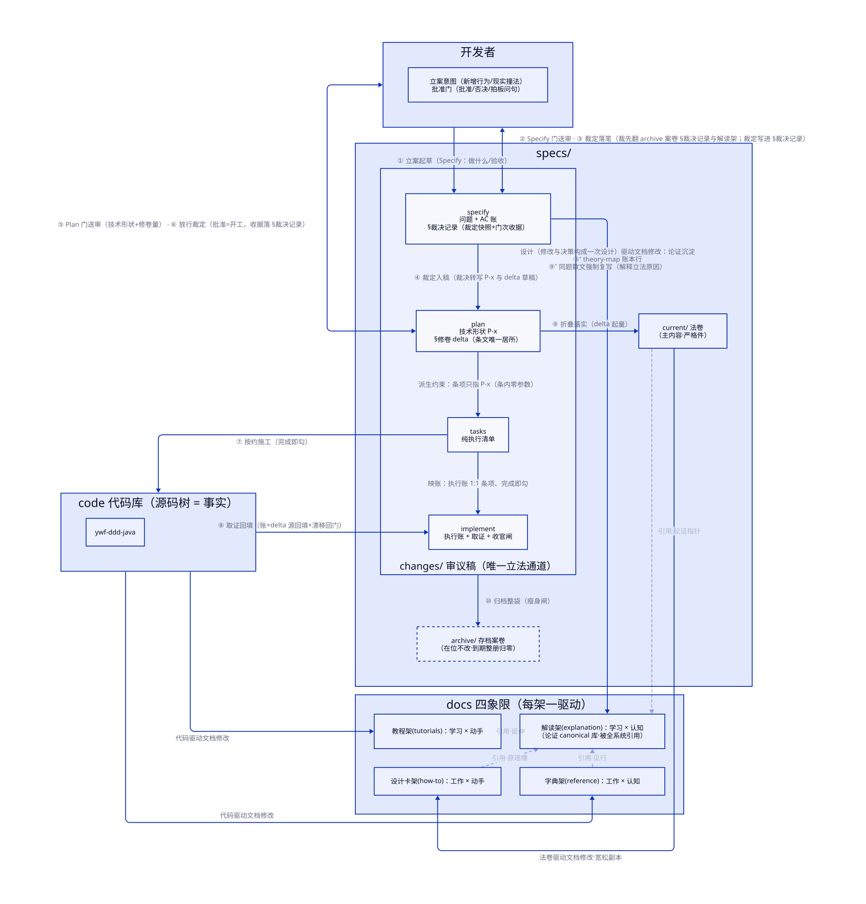

# knowledge/ —— 项目知识伞（组织宣言）

这是全仓库文档的统一住所。它解决一个问题：**同一件事写在好几处，代码变了没人知道该改哪份，最后每份都烂掉**。目录结构由下面五个问题的答案决定，读完五答，树形自然清楚。

## 五问五答

| # | 问题 | 本仓的答案 | 落在 |
|---|------|-----------|------|
| 1 | **谁听谁的？** 一句话烂了，轮谁改？ | 文档只有两类。**地图**：描述代码，代码变了它必须跟着变。**法律**：承诺行为，代码违反了就去修代码。裁决和当时的理由不单独成第三类，记在做出裁决的那份案卷里 | `docs/`、`specs/` 两区；案卷住 `specs/changes/` 与 `archive/` |
| 2 | **一条规矩从讨论到废止，身份怎么变？** | 法律有三个身份：草案（`changes/`，随便改）→ 现行本（`current/`，只能在折叠生效那一刻写入）→ 封存（`archive/`，入封后在位不改，到期整册清掉）。全套文档的同步修补只发生在"草案折进现行"那一刻，平时不动 | 各区 `specs/` 的三个目录；业务法同构镜像在 `sample-application/specs/` |
| 3 | **读者打开文档时想要什么？** | 地图区按 Diátaxis 四象限摆架：教程 / 设计卡 / 字典 / 解读，一篇文档只进一个架 | `docs/` 内四书架，见 §2 |
| 4 | **知识摆出来还是藏起来？** | 项目知识全部公开摆在 `knowledge/`。只有"教 AI 怎么干活"的 SOP 收进 `.agents/`：那个路径是各工具钉死的扫描位置，工具可以换，知识不丢 | 伞内 vs 伞外 |
| 5 | **离代码放多近？** | 不贴源码——一纸契约跨五个模块，贴哪边都偏心；不分仓——跟代码同库同 PR 同步更值钱。根级一把 `knowledge/` 收齐。将来若需独立评审，`specs/` 可以整袋搬出去（先例：PEP、KEP） | 根级 `knowledge/` |

两套框架分工明确，互不冲突：**两分类（问一）管分区**，Diátaxis（问三）只管地图区内部摆架。法律区不进四象限，它按身份分架（问二）。

## 1 · 两分类：一区一法律

| 区 | 性质 | 规则一句话 | 法律全文在哪 |
|---|---|---|---|
| `docs/` | 地图（描述） | 代码变了它没跟 → 这是文档 bug，改文档 | [归属法](specs/current/patterns/meta/attribution-law.md) |
| `specs/` | 法律（框架契约） | 代码违反它 → 改代码。改法必须走 `changes/` 程序，禁止为了迁就代码偷改法条。docs 同题文章与法卷冲突时，法卷为准。`archive/` 只进不改，到期整册归零 | `specs/README.md` |
| `scripts/` | 执法（工具链） | 不是知识，是守护前两区的机器检查。工具行为以代码为准，说明书住字典架 | [docs/reference/doc-guards.md](docs/reference/doc-guards.md) |

为什么必须拆开：地图区的规则是"烂了就直接改文档"。法律如果也住在那，等于允许随手改法。所以两区互不相犯，各区的法只在自己目录生效，**伞本身不立法**。旧方案里裁决曾独立成区，现已并入案卷——裁决与立法过程同件封存。

**业务契约不入伞**（2026-09-06 辖域裁定）：伞只装框架/脚手架层的通识。示例业务的行为法住镜像区 [`sample-application/specs/`](../sample-application/specs/README.md)——契约写的是生意，容器跟着内容走。

## 2 · Diátaxis：地图区摆架法

两条轴切四格：读者是来学习还是来工作？要动手还是要认知？

| | 学习 | 工作 |
|---|---|---|
| **动手** | `tutorials/` 教程：零基础线性步骤，带你第一次跑通 | `how-to/` 设计卡：该不该用、怎么选。具体形状全在法卷 |
| **认知** | `explanation/` 解读：背景、权衡、设计动机，讲"为什么" | `reference/` 字典：描述性事实，供查证（用法条款已迁入法卷） |

一篇文档按读者处境进一个架，不拆成四份。**四个书架只放描述**："必须/禁止"这类规定句在架上没有住处，一律上移住 `specs/` 法卷（宽严双份制）。归属判据一句话：**这句话能机械化执行吗？能 → 法卷；不能（依赖语气、步骤、语境）→ docs。**

### 2.1 驱动关系（D2 图）

这张图回答两件事：**立法流程的十个步骤**（编号边 ①–⑩）和**平时谁驱动谁改**（无编号边）。读图前记住三条：

- 上标 ⁺（③⁺、⑨⁺）是挂靠在该步骤时刻的分支动作，不增加主干步数。
- 流程的发起方和裁决方是同一个人：开发者，即项目主。AI 只起草案卷、执行施工；两道批准门必须停下等人拍板。代码本身只是被改的对象，不立案、不施工。
- 图只画合法路径。偷改 `current/`、未批先施工这类行为不入图——非法路径没有资格占用版面。



> 图源 = [`diagrams/knowledge/README/drive-relations.d2`](diagrams/knowledge/README/drive-relations.d2)（唯一可编辑面）。改源后重刷：`powershell -NoProfile -ExecutionPolicy Bypass -File knowledge/scripts/render-diagrams.ps1`（TALA 引擎）；防陈旧对账：同法跑 `check-diagrams.ps1`。

每条边的法源都能在 [归属法](specs/current/patterns/meta/attribution-law.md) §1/§2/§4 或 `new-bill` 技能对应步骤找到。图只做导览，不立法。下面两张表列全图所有边。

**立法十步**（编号即工序先后；②③、⑤⑥ 是两道门的往返）：

| 步骤 | 发生什么 | 法源锚 |
|---|---|---|
| ① 立案起草 | 开发者对照归属法 §4 强制同步表判断要不要立案；立则在 `changes/{slug}/` 铺四件套。对不上表的分支不立空案 | `new-bill` 步骤 1–3 |
| ②③ Specify 门 | agent 递验收账（AC-n）、边界、待裁问句，硬停等项目主。拍板前先翻 `archive/` 旧案卷确认无撞案。裁定写进 specify §裁决记录：表决行、当时理由、门次收据 | `new-bill` 步骤 4；归属法 §2 |
| ④ 裁定入稿 | 把裁定转写成 plan 的技术裁量（P-x）和修卷 delta 草稿。`changes/` 内是审议稿，随便改 | `new-bill` 步骤 4 |
| ⑤⑥ Plan 门 | 项目主裁方案和修卷量；过这道门才可施工。每案两停不论大小；并门或豁免只允许在会话中由项目主明示 | `new-bill` 步骤 4 |
| ⑦ 按约施工 | 按 tasks.md 推进，完成一条勾一条 | `new-bill` 步骤 5 |
| ⑧ 取证回填 | 勾账和证据落 implement.md；plan delta 每条 SHALL 的取证源，折叠前回填成真实 文件:行/测试名。构建测试全绿按变更性质定档 | `new-bill` 步骤 5–7 |
| ⑨ 折叠落实 | 把 plan 修卷 delta 写回 `current/`：ADDED 入位、MODIFIED 整节替换、REMOVED 删节留原因。这是文档同步义务的唯一时点 | `new-bill` 步骤 6.1；归属法 §4 |
| ⑩ 归档 | 整个案卷目录 `git mv` 进 `archive/`，不拆件；此后在位只进不改，到期由清册 bill 整册归零 | `new-bill` 步骤 6.2–6.4 |
| ③⁺ / ⑨⁺ 分支 | ③⁺：裁定落笔当刻在 [theory-map](docs/explanation/theory-map.md) 记一行账。⑨⁺：折叠当刻把沉淀论证（现行版）复写进同题解读篇，篇脚回指"→ 案卷 <date-slug> §裁决记录（决策快照）" | 归属法 §4 对应两行 |

**常态驱动边**（无编号）：

| 边 | 规则 | 法源锚 |
|---|---|---|
| plan → tasks | tasks 条目只是可验收动作，零参数、指回 P-x；施工图唯一来自 plan | [changes/README](specs/changes/README.md) |
| tasks → implement | implement 执行账与 tasks 条目 1:1 镜像，完成即勾，禁攒批 | 归属法 §4 |
| 代码 → tutorials、reference | 纯地图：与代码不符就是 bug，当天修 | 归属法 §1、§2 |
| current/ → how-to | 设计卡是法条的宽松副本，冲突时法卷赢 | 归属法 §2 |
| current/ ⇢ explanation | 淡边 = 引用不是驱动。修法不直接动解读篇：法的修改要生效，论证要变，必须经过一次新裁决。法卷涉论证处只放指针（零复制原则） | 归属法 §2 |
| how-to ⇢ explanation | 每张设计卡首行固定"设计原理 → ../explanation/*.md"（13/13 全覆盖） | [how-to/README](docs/how-to/README.md) |
| reference、tutorials ⇢ explanation | 字典"→ 见"行、教程末节延伸都指解读架。解读架是全系统被引用最广的论证库 | [glossary](docs/reference/glossary.md)、[quickstart](docs/tutorials/quickstart.md) |

图外还有两处引用面：根 AGENTS.md 的路由（"为什么 → explanation/"），以及 `new-service`、`modify-common-module`、`ddd-review` 三个技能的同步清单指针。

## 3 · 树

```
knowledge/
├── README.md       本页：组织宣言（讲清结构为什么这样，本身不立法）
├── docs/           地图区 | README 是唯一文档索引
├── diagrams/       配图 | .d2 源按文档相对路径镜像存放，渲染出的同名 SVG 与源并存于同目录（render/check-diagrams.ps1 两脚本，源是唯一可编辑面）
│   ├── tutorials/  quickstart：从 clone 到跑通
│   ├── how-to/     设计卡（{agg} 中立教例，零形状代码，规范在法卷）
│   ├── reference/  api/ 框架模块 8 篇 · doc-guards.md 工具说明 · glossary 术语表
│   └── explanation/ 分层设计 5 篇 + 专论 8 篇（知识系统/云集成/安全/可观测/测试/规则集设计/摆架 rationale/类型化身份）+ theory-map 理论账本
├── specs/          法律·框架区 | current/modules/ 模块法卷 · current/patterns/<十摊>/ 模式法卷（摊进路径；摆架宪法 → patterns/meta/pattern-taxonomy.md）· changes/ 审议中案卷 · archive/ 封存（业务法在 ../sample-application/specs/）
└── scripts/        执法 | check-docs.ps1 七校验 + 豁免白名单 + lychee 配置
```

## 4 · 机器执法

靠自觉的守则一定会腐烂，所以全部文档纪律都配了机器检查。`scripts/check-docs.ps1` 跑七道校验，任何一道不过就红：幽灵路径（写了源码不存在的目录）、计数漂移（"13 篇"之类宣称与磁盘不符）、符号鬼魂（引了不存在的类）、教学词违规（文档夹带 order/product 业务名）、映射表漏更（异常映射三方不一致）、案卷在位改判与废号零容忍、技能闸（skill 引用失效）。交付前必跑，`ddd-review` 末步已内置；豁免白名单只删不增。
