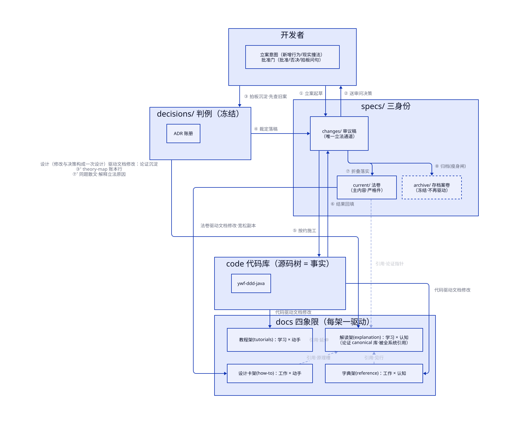

# knowledge/ —— 项目知识伞（组织宣言）

这把伞治仓库文档的一个老病：**同一句话住在多处，腐烂时没人知道该谁改**。目录为什么长这样，是五个问题的答案——读完五答，树形不言自明。

## 五问五答

| # | 问题 | 本仓答案 | 落在 |
|---|---|---|---|
| 1 | **谁听谁的？** 一句话腐烂了，轮谁改？ | 三分类：地图（文档跟代码）、法律（代码跟文档）、卷宗（谁也不跟） | `docs/` `specs/` `decisions/` 三区 |
| 2 | **身份何时会变？** 同一念头从讨论到定法到废止，改法完全不同 | 法律分三层：过程稿 → 现行本 → 存档；归档折叠那一刻是文档同步义务**唯一**发生的时点 | 各区 `specs/` 的 changes/ archive/（current/ 首案开册）；业务法同构镜像在 `sample-application/specs/` |
| 3 | **读者打开时想要什么？** | Diátaxis 四象限：教程 / 手册 / 字典 / 解读 | `docs/` 内四书架（§2） |
| 4 | **藏起来还是摆出来？** | 知识全摆明面；教 agent 怎么干活的"方法"藏 `.agents/`（工具原生扫描路径钉死，且工具可弃、知识不可弃） | 伞内 vs 伞外 |
| 5 | **离代码放多近？** | 不贴源码（一纸契约跨五个模块，贴哪都偏心），不分仓（暂无独立治理需求，同 PR 原子同步更值钱）——**根级一伞统一存放，知识不散落多处** | 根级 `knowledge/`；退路：将来需要独立评审时 `specs/` 整袋迁出（先例：PEP、KEP） |

品味说明：本仓同时实现两套经典方案，不冲突因为它们作用在不同层——**三分类（问一）管分区，Diátaxis（问三）只管地图区内部摆架**。法律区与卷宗区不入四象限，它们的分架轴是问二的效力身份。

## 1 · 三分类：一区一法律（问一的答案）

| 区 | 态 | 守则一句话 | 法律全文 |
|---|---|---|---|
| `docs/` | **地图**（描述） | 代码变了它没跟 → 文档是 bug，修文档 | `knowledge/specs/current/patterns/attribution-law.md`（归属法） |
| `specs/` | **法律**（框架契约：行为承诺 + 严格用法规范） | 代码违反它 → 修代码；要改法 → 走 changes/ 程序，禁止迁就代码偷改；docs 同题指引为宽松件，冲突法卷赢 | `specs/README.md` |
| `decisions/` | **判例卷宗**（冻结） | 正文永不回改；推翻 = 新立案 + supersede 旧案 | `decisions/README.md` |
| `scripts/` | **执法**（工具链） | 非知识，是守护前三区的机器检查；行为以代码本体为准，说明住字典架 | [docs/reference/doc-guards.md](docs/reference/doc-guards.md) |

为什么要拆开：地图区守则"烂了修文档"是溶剂——法律若寄居地图区，执法力就被泡掉；卷宗若寄居任何活区，会被"好心"重写。故三区互不相犯、每区法律在自己目录生效，**伞本身不立法**。

**业务不入伞**（2026-09-06 辖域裁定）：伞只装框架/脚手架层的通识。示例业务的行为法住镜像区 [`sample-application/specs/`](../sample-application/specs/README.md)——契约天然记生意，容器跟着内容走。

## 2 · Diátaxis：地图区的摆架法（问三的答案）

两条轴切四格：横轴问"来学习还是来工作"，纵轴问"要动手还是要认知"。

| | 学习 | 工作 |
|---|---|---|
| **动手** | `tutorials/` 教程：零基础练习场，线性步骤带你完成第一次 | `how-to/` 设计卡：该不该用、怎么选（浅层指引；一切用法形状在 specs 法卷） |
| **认知** | `explanation/` 解读：背景、权衡、设计原理——讲"为什么" | `reference/` 字典：描述性事实，结构严格，供查证（用法条款已入法卷） |

一篇文档按读者处境进一个架，不拆写四份——这是摆架的全部意义。**但象限只管描述**：规定句（"必须/禁止/应当这样写"）在四格里没有执照，一律上移一层住 `specs/` 法卷（2026-09-06 宽严双份裁定）。判据：**这句话能机械化执行吗？能→法卷；不能（语气/步骤/语境）→ docs。**

### 2.1 驱动关系（D2 图）

「地图=代码驱动」是 §1 表的压缩口号——四书架的真相源其实分叉。本图两类边：**带圈编号 ①–⑧ = 立法流程的先后序**（箭头太多，光靠方向表达不了顺序，编号即工序，**上标 ⁺ = 挂在该步时刻的分支义务**（如 ③⁺/⑦⁺ 论证沉淀，不改主线八步））；流程的发起方与裁决方是**同一个人：开发者＝项目主**（AI 只递案卷，批准门硬停等拍板）——代码只是被驱动的事实，不立案、不施工）；**无编号 = 常态驱动归属**（docs 四象限每架认一个主：tutorials/reference=纯地图受代码驱动、how-to=法条宽松副本受 `current/` 直驱、explanation=知识沉淀件——**架构决策的论证现行版（"今天为什么如此"）canonical 居本架**（ADR-0036：卷宗只留事件、当时思考与授权收据；折叠 ⑦⁺ 强制复写至此，篇脚回指快照；"一次设计=修改+决策"的为什么同理在此），同时是**全系统引用面最广的 canonical 库**——how-to 全卡/字典见行/教程延伸/法卷论证指针四路引用它，图上淡虚线=阅读时引用（非驱动）。图外引用面还有两处：根 AGENTS 路由「为什么 → explanation/」与 skills 同步清单（`new-service`/`modify-common-module`/`ddd-review` 均指针到解读架）。**一切按流程安排，非法路径（偷改 `current/`、未批先施工）不入图**：意图的唯一合法出口就是 ①，画歪门反而稀释正门。每条边都可在 [specs/current/patterns/attribution-law.md](specs/current/patterns/attribution-law.md) §1/§2/§4 或 `new-bill` 步骤翻到法源（锚见表），本图只作导览、不立法（伞不立法）。



> 图源 = [`diagrams/knowledge/README/drive-relations.d2`](diagrams/knowledge/README/drive-relations.d2)（唯一可编辑面）。改源后重刷：`powershell -NoProfile -ExecutionPolicy Bypass -File knowledge/scripts/render-diagrams.ps1`（TALA 引擎）；防陈旧对账：同法跑 `check-diagrams.ps1`。

| 边（编号=工序，无编号=常态） | 法源锚 |
|---|---|
| ① 开发者 → changes/「① 立案起草｜全名：判断立案·起草三件套」 | 立案发起人是**开发者的意图**（想新增行为/发现现实与法不合），不是代码自己——代码只是被驱动的事实。工序锚：`new-bill` 步骤 1–3（归属法 §4 强制同步表逐行判触发，对不上不立空案；模板 `_template/`） |
| ② changes/ → 开发者（＝项目主）「② 送审问决策」 | `new-bill` 步骤 4 批准门：agent 递案必须硬停等人，批准前禁施工 |
| ③ 开发者（＝项目主）→ decisions/「③ 拍板沉淀·先查旧案」 | [decisions/README](decisions/README.md)：ADR 随裁决产生、append-only 冻结。**判例先行**（折注于此边）：项目主拍板**之前**必先翻卷宗确认无撞案；撞案则旧案正文一字不动（C6 闸执法），**新立 ADR 于状态行 supersede 旧案**——推翻=立新规接管，非删旧规（§1 decisions 行、根 AGENTS「先查旧判例再拍新板」）。不再单画平行边——同端点平行边是 TALA 标签漂移病灶 |
| ④ decisions/ → changes/「④ 裁定落稿」 | 审议期纪律：`changes/` 内=审议稿随便改（步骤 2）；两阶段批准判例（proposal 先批、再补 delta/tasks，步骤 3 末注） |
| ⑤ changes/ → 代码「按约施工」 | `new-bill` 步骤 5：按 tasks.md 推进、完成一条勾一条、范围要扩回批准门 |
| ⑥ 代码 → changes/「⑥ 结果回填」 | 步骤 5–7：勾账 + 构建/测试全绿按变更性质定档；delta 每条 SHALL 取证源折叠后须指真实 文件:行/测试名 |
| ⑦ changes/ → current/「⑦ 折叠落实」 | `new-bill` 步骤 6.1（ADDED 入位/MODIFIED 整节替换/REMOVED 删节留因）= 归属法 §4 文档同步义务**唯一时点** |
| ⑧ changes/ → archive/「⑧ 归档(瘦身闸)｜整目录 git mv」 | 步骤 6.2 整目录 `git mv` 不拆件 + 6.3 只进不改 + 6.4 瘦身闸（→ 归属法 §4「案卷折叠入 archive 前」行） |
| **③⁺/⑦⁺ 分支** decisions/ → 解读架(explanation)「设计（修改与决策构成一次设计）驱动文档修改：论证沉淀 ③⁺ theory-map 账本行／⑦⁺ 同题散文强制复写（解释立法原因）」 | 论证沉淀是挂在线上两个时刻的分支义务：③⁺ 拍板当刻在 [theory-map](docs/explanation/theory-map.md) 记账本行——归属法 §4「新设计决策」行把 ADR 新立与账本登记钉同一行；⑦⁺ 折叠当刻**沉淀论证强制复写进同题解读篇、篇脚回指 `ADR-NNN（决策快照）`**——[归属法 §4「案卷折叠时（⑦⁺）」行](specs/current/patterns/attribution-law.md)（[ADR-0036](decisions/ADR-0036-adr-argument-sedimentation.md) 起：卷宗只当冻结的事件与当时思考，论证现行版的 home 在解读架；划界判据"法生效后该理由是否仍成立且指导读法"；事务性决策一行账即止，存量触发式随位收编） |
| 代码 → 教程架(tutorials)「代码驱动文档修改」 | 归属法 §1 docs 行「与代码不符=文档是 bug；写入时钟：代码之后」；可运行性含环境前置（[docs/README](docs/README.md) 四架表：从零跑通） |
| 代码 → 字典架(reference)「代码驱动文档修改」 | §2「包路径/类名/方法签名 → 源代码」「异常→HTTP 映射 → javadoc+法卷+C5」两行 |
| current/ → 设计卡架(how-to)「法卷驱动文档修改·宽松副本」 | §2「用法规范/规范代码形状」行：docs 同题=设计卡（宽松件）、**冲突法卷赢**（宽严双份制） |
| current/ ⇢ 解读架（淡边）「引用·论证指针」 | **时效上无直驱边**（法条改论证存活，影响必经 ③ 新判例中转——与设计卡架"直驱宽松副本"恰成对照）；**引用上有真边**：法卷涉论证/对照表处只放指针不复制（D6 零复制），`external-gateway.md`「对偶结构对照表 canonical 只在解读架」、CC-6 理由账本 → theory-map、归属法 §2 设计论证行 canonical=`docs/explanation/` 自身 |
| how-to 全卡 ⇢ 解读架「引用·原理槽」 | 每张设计卡首行固定位 `> 设计原理 → ../explanation/*.md`（13/13 全卡覆盖，[how-to/README](docs/how-to/README.md) 三架分工表） |
| reference ⇢ 解读架「引用·见行」 | [glossary](docs/reference/glossary.md) 多行「→ 见 theory-map / infrastructure / adapter」；「理论账本」词条 |
| tutorials ⇢ 解读架「引用·延伸」 | [quickstart](docs/tutorials/quickstart.md) 末节「读懂每层为什么这样设计 → explanation/」 |

## 3 · 树

```
knowledge/
├── README.md       本页：组织宣言（导览五问三分类，自身不立法）
├── docs/           地图 | README 唯一文档索引
├── diagrams/       配图 | .d2 源按「文档仓库相对路径」镜像入册，gen/ 存 TALA 渲染 SVG 产物（render/check-diagrams.ps1 双件，源为唯一可编辑面）
│   ├── tutorials/  quickstart：clone 到第一次跑通（真实例操作手册）
│   ├── how-to/     设计卡（{agg} 中立教例，零形状代码——规范在法卷）
│   ├── reference/  api/ 框架模块 8 篇 · doc-guards.md 工具说明 · glossary 术语表
│   └── explanation/ 分层设计 5 篇 + knowledge-system 知识系统自解读 + theory-map 理论账本
├── specs/          法律·框架 | current/{modules|patterns}/ 法卷 · changes/ 审议稿 · archive/ 存档（业务法→ ../sample-application/specs/）
├── decisions/      卷宗 | ADR-NNNN 全局唯一编号，append-only
└── scripts/        执法 | check-docs.ps1 七校验 + 豁免白名单 + lychee 配置
```

## 4 · 机器执法

靠自觉的守则一定腐烂。`scripts/check-docs.ps1` 七校验——幽灵路径、计数漂移、符号鬼魂、教学词违规、映射表漏更、判例回改、技能闸，全部当场变红；交付前必跑（`ddd-review` 末步已内置），白名单只删不增。
